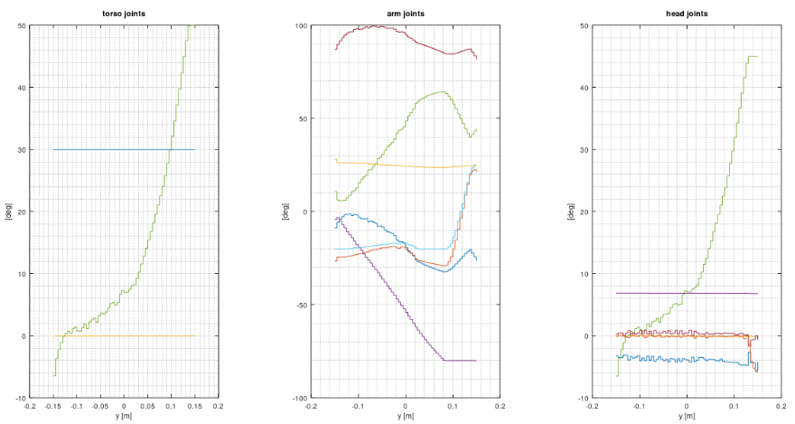
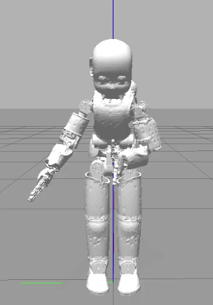

Study on Air Hockey
===================

[](https://gitpod.io/#https://github.com/pattacini/study-air-hockey)

# ℹ The Problem
While iCub plays air hockey, it is required to keep the gaze as stationary as possible in order
to minimize the effects of the ego-motion in the camera images.

The standard approach that recruits IK and head stabilization via inertial feedback tends to be
slow if compared with the velocities at stake. To get around this problem, one could consider
solving IK offline and thus running at full speed being liminted only by other low-level factors
such as PID controllers.

The problem has been analyzed and tackled in the following [studies](#-studies).

# ⚙ Build
```sh
$ mkdir build && cd build
$ cmake ..
$ make install
```
The code has been tested in [Gitpod](https://gitpod.io) 🌐

Find out more on [YARP-enabled Gitpod workspaces](https://github.com/robotology/community/discussions/459) 🔎

# ▶ Run
Just run `yarpserver`, launch first the [`system app`](./app/scripts/study-air-hockey-system.xml)
and then the study-related [applications](./app/scripts).

# 📐 Studies

## 👨🏻‍💻 [Study 1](./src/study-1.cpp)
This study aims to sample the joint trajectories spanned by the torso, the arm and the head
as found by IK while the hand moves along the allowed path.

The samples are conveniently stored in a table. An example is given in [`table.tsv`](./app/conf/table.tsv),
where the columns have the following meaning:

| 1 | 2...4 | 5...11 | 12...17 |
| :---: | :---: | :---: | :---: |
| end-effector y-coordinate | torso joints (reversed order) | arm joints | head joints |

You can also plot the content of the table by doing
```sh
$ cd plotting
$ ./plot.sh <path-to-the-table-file>
```
and thus getting something like the following graph:

| Example table|
| :---: |
|  |

The module can be configured via command-line options up to a certain extent.

## 👨🏻‍💻 [Study 2](./src/study-2.cpp)
We replay here the target joints saved within the table in the previous study.
The main idea 💡 is to be able to go as fast as possible having spared the burden
of doing IK online.

The output trajectories are interpolated using splines. To this end, we make use of
[**`ttk592/spline`**](https://github.com/ttk592/spline) as a dependency.

The desired location of the hand along the allowed path can be provided by sending
a number within [-1, 1] to the YARP port `/study-air-hockey/target`. 

| Example output |
| :---: |
|  |
